# Irish Road Signs

A collection of Irish road signs for studying for the Irish driving test.

Each image filename is a description of the sign.

## Anki Deck

This repository can generate an Anki deck where the front of each card is the sign image and the back is the sign description derived from the filename.

### Load the Deck in Anki

1. Install Anki from [apps.ankiweb.net](https://apps.ankiweb.net/) if you do not already have it.
2. Open Anki on your computer.
3. In Anki, click `File` -> `Import`.
4. Select `dist/irish-road-signs.apkg` from this repository.
5. Confirm the import when Anki shows the deck preview.
6. Open the imported `Irish Road Signs` deck.
7. Start studying. Each card shows the sign image first, and the answer reveals the sign description.

If you want the latest version of the deck package before importing, rebuild it first:

Build the deck with:

```bash
python3 scripts/build_anki_deck.py
```

The generated package is written to `dist/irish-road-signs.apkg`.

### Automatic Deck Updates

This repository now updates the generated Anki deck automatically.

- The GitHub Actions workflow at `.github/workflows/update-anki-deck.yml` rebuilds `dist/irish-road-signs.apkg` when sign images or the deck script change on `main`.
- Pull requests that change sign images or the deck script also verify that the checked-in `.apkg` file is up to date.
- The deck build is deterministic, so rebuilding the same inputs should produce the same `.apkg` binary.

### Supported Image Files

The deck builder currently includes tracked image files in the repository root with these extensions:

- `.png`
- `.svg`
- `.jpg`
- `.jpeg`

### Adding a New Sign

1. Add the image file to the repository root.
2. Name the file with the sign description, using underscores between words, for example `mini_roundabout_ahead.svg`.
3. Commit and push the image to `main`, or merge a pull request containing it.
4. The workflow should rebuild `dist/irish-road-signs.apkg` automatically.
5. If needed, you can still rebuild locally with `python3 scripts/build_anki_deck.py`.

## Regulatory Signs

| | | | |
|---|---|---|---|
| 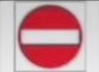 | 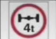 | 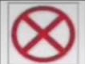 | 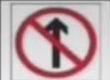 |
| 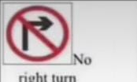 | 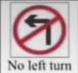 | 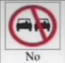 | 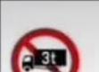 |
| 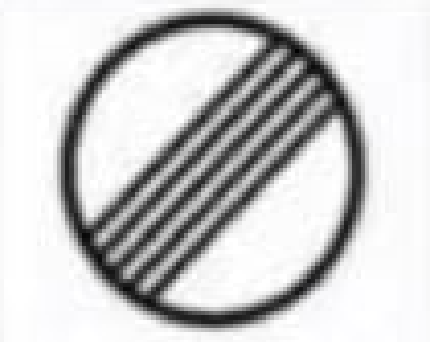 | 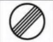 | 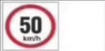 | 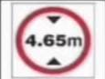 |
| 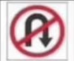 | 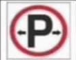 | 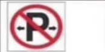 | 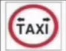 |
| 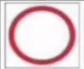 | 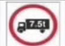 | 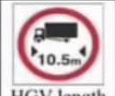 | 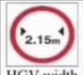 |
| 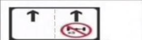 | 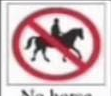 | 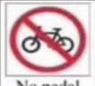 | 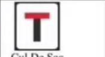 |

## Information Signs

| | | | |
|---|---|---|---|
| 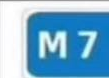 | 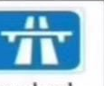 |  | 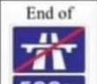 |
| 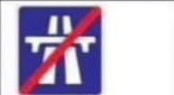 | 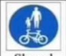 | 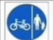 | 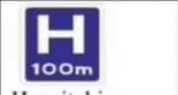 |

## Roadworks Warning Signs

| | | | |
|---|---|---|---|
| 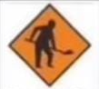 | 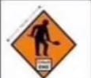 | 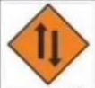 | 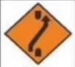 |
| 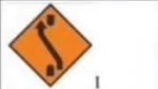 | 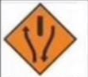 | 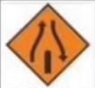 | 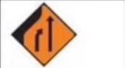 |
| 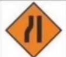 | 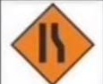 | 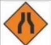 | 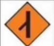 |
| 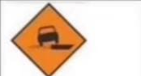 | 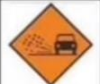 | 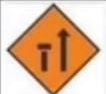 | 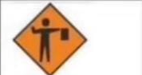 |
| 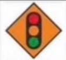 | 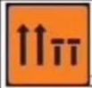 | 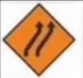 |  |
|  |  |  |  |
|  |  |  |  |
|  |  |  |  |

## Road Markings

| | | | |
|---|---|---|---|
|  |  |  |  |
|  |  |  |  |
|  |  | | |
